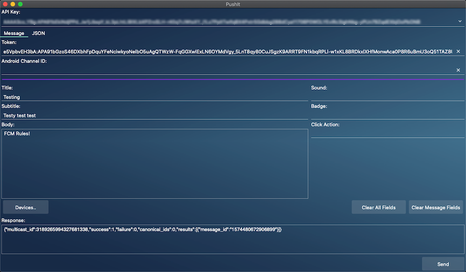
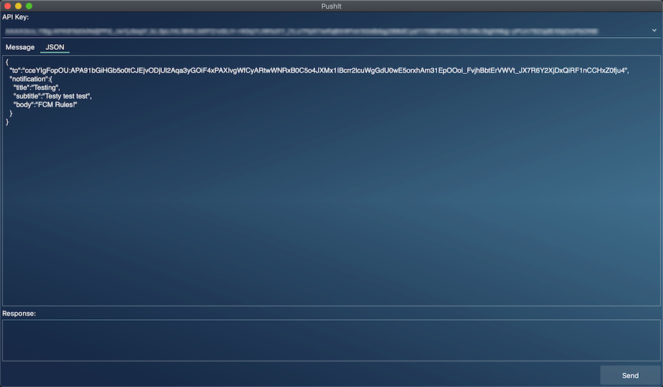
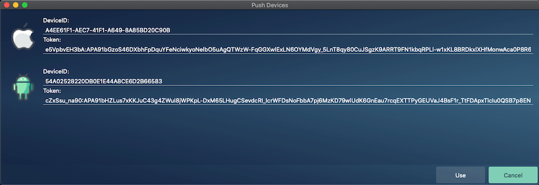

# PushIt

PushIt is a tool designed to make it easier for testing Firebase Cloud Messaging (FCM) to mobile devices

**NOTE: As of Dec 8th, 2021, the legacy HTTP API functionality has been removed from PushIt. If you require the original source code that includes it, I could make it available as part of this repo, however all future changes will not include the legacy API.**

## Application

### Main View

The main window allows you to enter your Service Account JSON File (HTTP v1 API), the device token to send to, and the fields that you want to include in the message:



#### Service Account JSON File

To obtain the file:

* Go into [Cloud Console](https://console.cloud.google.com/iam-admin/serviceaccounts)
* Select the project you have associated with Firebase Cloud Messaging
* If you do not have any service accounts listed with a name of `firebase-adminsdk` you will need to create one
* Once the account has been selected or created, go to the `Keys` tab
* Click Add Key and select Create a new key, then click Create
* The browser will prompt you to save the JSON file somewhere. **It does this only once, so make sure you keep the file**

You may now use this file in PushIt

#### Modifying the JSON

PushIt also allows you to modify (or create) the JSON that is sent:



When you fill out the message fields on the message tab, then switch to the JSON tab, PushIt creates the JSON for you, which you can then tweak as desired

### Devices View

In Kastri, there's a DataModule called TPushUDP (in the unit [DW.PushUDP](https://github.com/DelphiWorlds/Kastri/blob/master/Features/Notifications)). In your mobile application, if you create an instance of TPushUDP and call UpdateDeviceInfo with the DeviceID and Token when they become available, if the device is on the same local network, the information will be sent to PushIt, which will populate the Devices View with the devices that are running the mobile app:



Select a device and click the Use button to populate the Token field in the main view.

## Precompiled Versions

There are precompiled Win32/Win64 binaries of PushIt in the `Bin` folder of this repo. 

**Please note that if you will need to put the OpenSSL DLLs for the respective platform from the `Lib` folder either into the same folder as PushIt, or the Windows library path**

i.e. for Win32:
```
libcrypto-1_1.dll
libssl-1_1.dll
```

or for Win64:
```
libcrypto-1_1-x64.dll
libssl-1_1-x64.dll
```

These files were obtained from the [Grijjy Delphi OpenSsl repo](https://github.com/grijjy/DelphiOpenSsl/tree/master/Bin)

## Compiling PushIt

PushIt was written in Embarcadero's Delphi, using version 11.0, however it may compile for earlier versions.

PushIt depends on units from the [Kastri](https://github.com/DelphiWorlds/Kastri) project, so you will need to include a path to these units in order for PushIt to compile.

PushIt is an FMX application so it is cross-platform, however the recommended platforms are macOS and Windows.

On macOS, PushIt uses the files:
```
libssl-osx64.a
libcrypto-osx64.a
```
in the `Lib` folder for OpenSSL support. These files were obtained from the [Grijjy Delphi OpenSsl repo](https://github.com/grijjy/DelphiOpenSsl)

For Windows, please see the Precompiled Versions section regarding OpenSSL

In order to have PushIt use styles, please copy your desired .style files into the Styles folder as:

```
Application.Default.style (for Windows)
Application.macOS.style (for macOS)
```

When PushIt is built, the style for the respective platform will be compiled into the into the application, and loaded at runtime. If you do not wish to use styles, you will need to remove the following line from the project source:

```{$I Styles.inc}```

The screenshots (above) for PushIt use the Calypso style from [Delphi Styles](https://delphistyles.com/)

## Version History

v3.0.0 (Dec 8th, 2021)

* Removed support for legacy HTTP API
* Refactored to use the [DW.FCMSender unit from Kastri](https://github.com/DelphiWorlds/Kastri/blob/master/Features/Firebase/DW.FCMSender.pas)
* Minor fixes

v2.0.0 (April 23rd, 2021)

* Added support for HTTP v1 API
* Last used token is now saved
* Added support for big text and big images on Android
* Minor fixes

v1.1.0 (January 4th, 2020)

* Added support for data element, and for including both notification and data elements in the payload
* Added support for retrieving the channel id from the UDP packet
  
v1.0.0 (November 25th, 2019)

* Initial release
