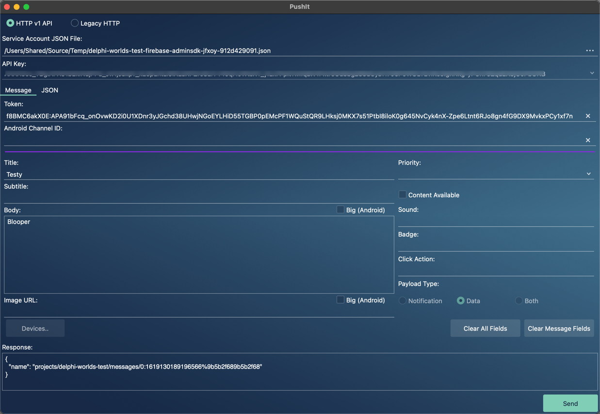

# PushIt

PushIt is a tool designed to make it easier for testing Firebase Cloud Messaging (FCM) to mobile devices

## Application

### Main View

The main window allows you to enter your FCM API key, the device token to send to, and the fields that you want to include in the message:



PushIt also allows you to modify (or create) the JSON that is sent:


When you fill out the message fields on the message tab, then switch to the JSON tab, PushIt creates the JSON for you, which you can then tweak as desired

### Devices View

In Kastri Free, there's a DataModule called TPushUDP (in the unit [DW.PushUDP](https://github.com/DelphiWorlds/KastriFree/blob/master/Features/Notifications)). In your mobile application, if you create an instance of TPushUDP and call UpdateDeviceInfo with the DeviceID and Token when they become available, if the device is on the same local network, the information will be sent to PushIt, which will populate the Devices View with the devices that are running the mobile app:


Select a device and click the Use button to populate the Token field in the main view.

## Compiling PushIt

PushIt was written in Embarcadero's Delphi, using version 10.3.3, however it may compile for earlier versions.

PushIt depends on units from the [Kastri Free](https://github.com/DelphiWorlds/KastriFree) project, specifically DW.Classes.Helpers and DW.Rest.Json.Helpers from the Core folder, so you will need to include a path to these units in order for PushIt to compile.

PushIt is an FMX application so it is cross-platform, however recommended platforms are macOS and Windows.

In order to have PushIt use styles, please copy your desired .style files into the Styles folder as:

```
Application.Default.style (for Windows)
Application.macOS.style (for macOS)
```

When PushIt is built, the style for the respective platform will be compiled into the into the application, and loaded at runtime. If you do not wish to use styles, you will need to remove the following line from the project source:

```{$I Styles.inc}```

The screenshots (above) for PushIt use the Calypso style from [Delphi Styles](https://delphistyles.com/)

## Version History

v1.1.0 (January 4th, 2020)

* Added support for data element, and for including both notification and data elements in the payload
* Added support for retrieving the channel id from the UDP packet
  
v1.0.0 (November 25th, 2019)

* Initial release
